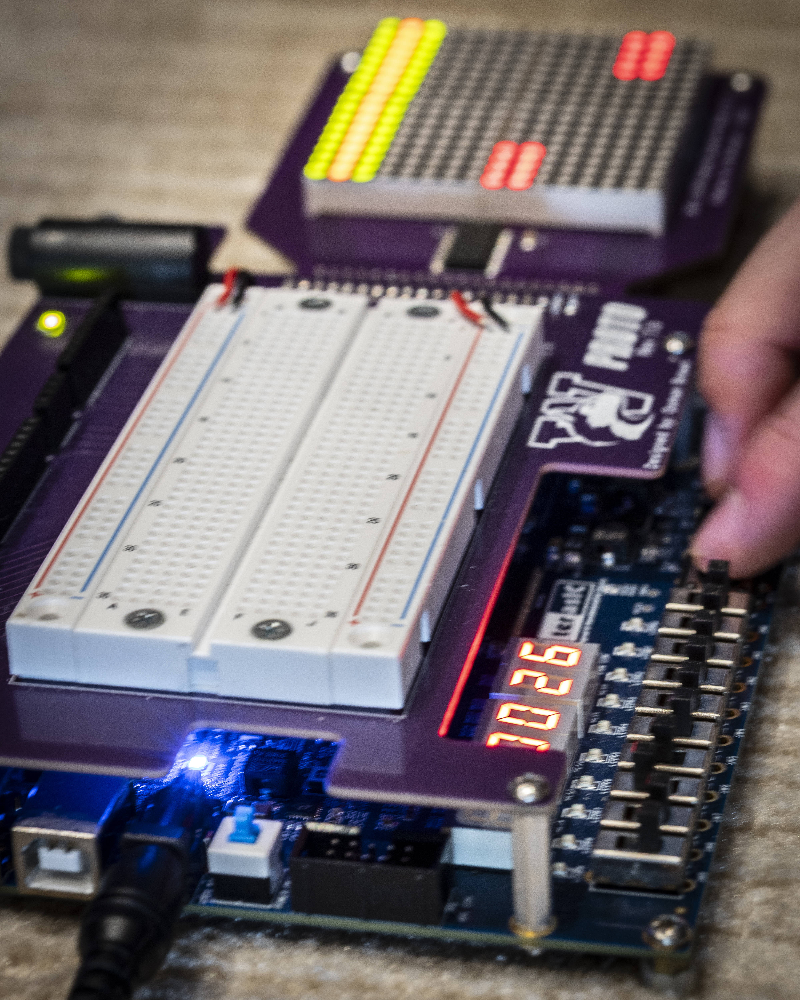
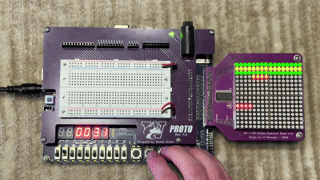

# Dancing with your Thumbs

Dancing with your Thumbs is a four-lane rhythm game implemented in SystemVerilog on a DE1-SoC FPGA. It was completed as a solo final project for the University of Washington's EE 271 course over two weeks in Spring 2026.

## Features

- Four independently generated note lanes on a 16x16 red/green LED matrix
- Seeded 10-bit LFSRs for pseudorandom note generation
- Good and perfect timing regions with color-coded hit feedback
- Button presses are captured and held until the next game update, so quick inputs aren't missed
- Four selectable game speeds: easy, normal, hard, and extreme
- A four-digit score that saturates from 0000 to 9999

A full demo of the game's basic features can be found [here](Media/DWYT_demo.mp4).

## Hardware and controls

The design is for the Terasic DE1-SoC board's Cyclone V FPGA (`5CSEMA5F31C6`) and a 16x16 bicolor LED matrix expansion board. The 16x16 board came from UW, so it may not be commercially available.

| Input | Function |
| --- | --- |
| `KEY[3:0]` | Rhythm-game lane buttons |
| `SW[8:7]` | Difficulty selection |
| `SW[9]` | System reset |

The four score digits are displayed on `HEX3` through `HEX0`. Hitting a note with perfect timing (2nd row from the top) awards two points. Hitting one off from that, so the top row or the third row, awards one point. Missing a note - either by hitting early or letting it roll off the top - will subtract two points from the player's score.

## Architecture

Each lane is implemented as a chain of finite-state machines representing the rows of the LED matrix. A seeded LFSR determines when a new note enters an empty lane. Only one note can appear at a time in each lane, and there's a brief delay between a note disappearing and a new one being allowed to spawn. The upper three rows implement the good/perfect/good scoring windows, while the remaining rows detect early presses and missed notes.

Each button is read twice before the game uses it, then a press is held until the next game update. This helps avoid an unstable reading if a button changes right as the FPGA checks it, and keeps quick presses from being missed.

The game logic builds two 16x16 maps of which LEDs should be on: one for red and one for green. A course-provided driver reads those maps and sends the correct signals to the LED matrix.

The saved Quartus build successfully synthesized and fit on the target FPGA using 211 ALMs and 194 registers.

## Repository layout

- `Dancing with your Thumbs/` - SystemVerilog source, testbenches, and Quartus project files
- `Dancing with your Thumbs User Manual.pdf` - controls and gameplay rules
- `Dancing with your Thumbs Market & Usability Analysis.pdf` - design iterations and usability decisions

Generated Quartus and ModelSim files are excluded from version control.

## Building and running

1. Open `Dancing with your Thumbs/DE1_SoC.qpf` in Quartus Prime Lite 17.0.
2. Compile.
3. Connect the 16x16 LED matrix to GPIO 1 and turn on the DE1-SoC.
4. Program the generated bitstream onto the DE1-SoC.
5. Toggle `SW[9]` to reset the system, select a difficulty with `SW[8:7]`, and play using `KEY[3:0]`.

The included `runlab.do` script can be used with ModelSim-Intel FPGA Edition to compile the RTL and run the integration testbench.

## Attribution

All game logic, scoring, input handling, testbenches, and display-generation RTL were written by me (Ben Robison). The following course-provided modules were integrated into the project:

- `clock_divider.sv`
- `LEDDriver.sv`

The overall game concept was provided as one of many options by the course; build a four-lane DDR-style game with scoring and adjustable speed. The final implementation was designed by me, including a few additional features (such as flashing color-coded lights on a good or perfect).
